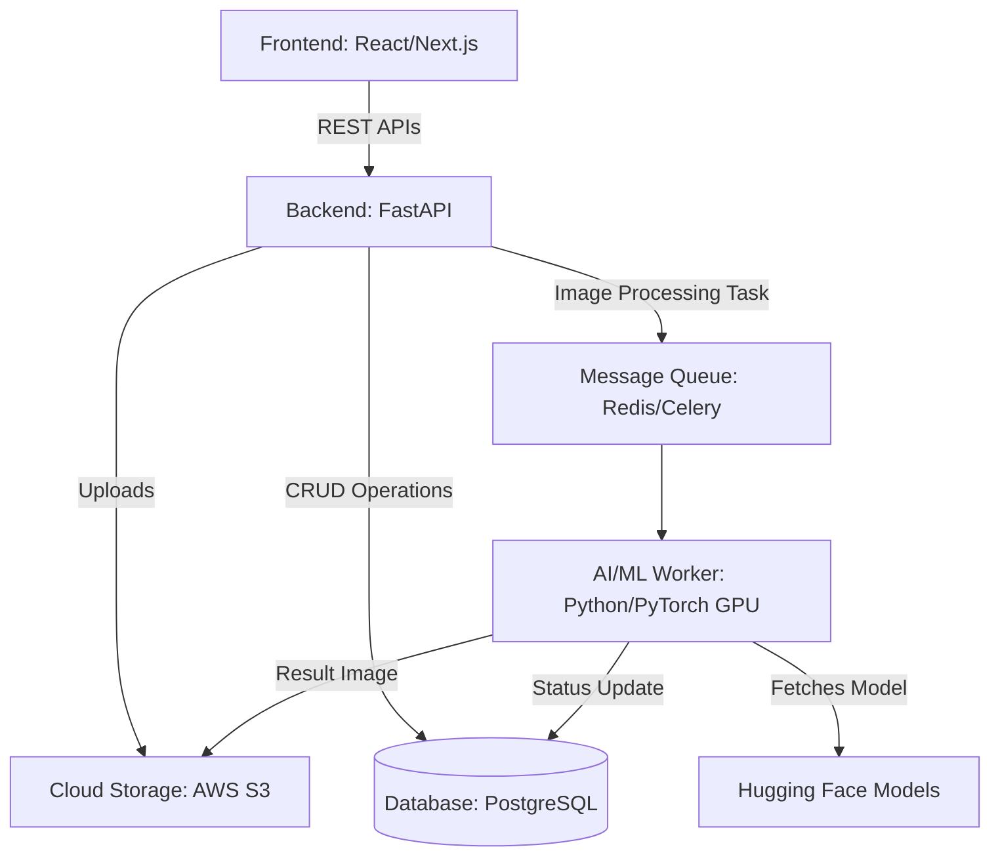

# Virtual Try-On Web Application: Implementation Plan & System Architecture

## 1. System Architecture Overview

The system follows a modern decoupled client-server architecture with a specialized AI microservice to handle the heavy image processing.

## 2. Technology Stack

*   **Frontend**: Next.js (React), Tailwind CSS, TypeScript
    *   *Why*: Fast loading, great SEO, excellent ecosystem for UI components, and easy deployment on Vercel.
*   **Backend**: Python with FastAPI
    *   *Why*: Native compatibility with Python-based ML ecosystems, blazing-fast asynchronous performance, and automatic API documentation.
*   **Database**:
    *   *Relational DB*: PostgreSQL (for Users, Outfits, Try-on History, Job tracking)
    *   *Object Storage*: AWS S3 or Cloudflare R2 (for storing raw user photos, dress photos, and generated AI outputs)
*   **AI/ML Pipeline**:
    *   *Model*: [OOTDiffusion](https://github.com/levihsu/OOTDiffusion), IDM-VTON, or StableVITON (State-of-the-art virtual try-on models)
    *   *Infrastructure*: RunPod or AWS EC2 with GPUs (Nvidia A10G/A100) for inference.
    *   *Task Queue*: Celery with Redis (Handles long-running ML tasks without blocking the backend).

## 3. Core Features

1.  **User Authentication**: Sign up, Login, and profile management.
2.  **Digital Closet**: Users can upload and manage their reference photos (full-body or half-body) and garment photos.
3.  **Virtual Try-On Engine**:
    *   User selects their photo.
    *   User selects a dress/garment photo.
    *   System generates a photorealistic image of the user wearing the selected dress.
4.  **Gallery & Lookbook**: Save previous try-on results so users can browse and download their generated looks.

## 4. AI/ML Implementation Details

Virtual try-on requires complex image processing. We will use a diffusion-based model optimized for garment transfer.

### AI Workflow:
1.  **Preprocessing**:
    *   Background removal on the dress image (using tools like `rembg`).
    *   Pose estimation of the user image (using OpenPose) to map body structure.
    *   Human parsing (segmentation) to identify body parts and remove the current clothes in the user's photo.
2.  **Inference**:
    *   The model takes the user image, the garment image, and the preprocessing maps.
    *   It generates a new image where the target garment replaces the original clothes, adapting to the user's pose, lighting, and body shape.
3.  **Post-processing**:
    *   Image enhancement and upscaling (optional) for HD results.

> [!TIP]
> **MVP Recommendation**: For the initial version, instead of hosting the ML model yourself (which requires expensive GPUs and devops), use an API service like [Replicate](https://replicate.com/) to access pre-hosted Virtual Try-On models. This will save weeks of development time and reduce initial infrastructure costs.

## 5. Database Schema (PostgreSQL)

*   **Users**: `id`, `email`, `password_hash`, `created_at`
*   **UserPhotos**: `id`, `user_id`, `s3_url`, `created_at` *(The base photos of the user)*
*   **Garments**: `id`, `user_id` (optional, can be global), `s3_url`, `category` (tops, bottoms, dresses), `created_at`
*   **TryOnJobs**: `id`, `user_id`, `user_photo_id`, `garment_id`, `status` (pending, processing, completed, failed), `result_image_url`, `created_at`

## 6. Phased Implementation Plan

### Phase 1: Foundation & UI (Weeks 1-2)
*   Initialize Next.js frontend and FastAPI backend repositories.
*   Set up PostgreSQL database and user authentication (JWT).
*   Create UI mockups and implement core frontend pages (Login, Dashboard, Digital Closet).

### Phase 2: Storage & API Integration (Weeks 3-4)
*   Integrate AWS S3 for secure image uploads.
*   Build backend API endpoints for uploading, deleting, and retrieving photos and garments.
*   Connect frontend UI to backend APIs.

### Phase 3: AI/ML Integration (MVP) (Weeks 5-6)
*   Set up Replicate API (or a basic custom GPU instance) for the Try-On model.
*   Implement a background task queue in FastAPI to handle ML requests without timing out HTTP requests.
*   Update database with job statuses and store result images.
*   Build frontend polling or WebSocket connection to show a loading state and reveal the final result.

### Phase 4: Polish & Deployment (Weeks 7-8)
*   Implement gallery view for past try-ons.
*   Add error handling and edge case management (e.g., detecting invalid images or unsupported poses).
*   Deploy Backend to Render/AWS, Database to Supabase/RDS, and Frontend to Vercel.
*   Conduct End-to-End Testing.
